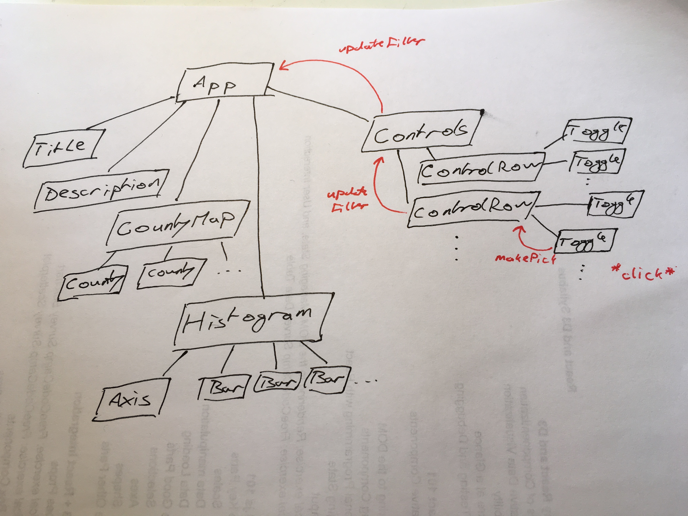

{#salary-visualization}
# A big example project - 176,113 tech salaries visualized #

We're going to build this:


An interactive visualization dashboard app with a choropleth map and a histogram comparing tech salaries to median household income in the area. Users can filter by year, job title, or US state to get a better view.


It's going to be great.

At this point, I assume you've used `create-react-app` to set up your environment. Check the [getting started](#getting-started) section if you haven't. I'm also assuming you've read the [basics chapter](#the-meat-start). I'm still going to explain what we're doing, but knowing the basics helps.

I suggest you follow along, keep `npm start` running, and watch your visualization change in real time as you code. It's rewarding as hell.

If you get stuck, you can use my [react-d3js-step-by-step Github repo](https://github.com/Swizec/react-d3js-step-by-step) to jump between steps. The [9 tags](https://github.com/Swizec/react-d3js-step-by-step/releases) correspond to the code at the end of each step. Download the first tag and run `npm install` to skip the initial setup.

If you want to see how this project evolved over 22 months, check [the original repo](https://github.com/Swizec/h1b-software-salaries). The [modern-code](https://github.com/Swizec/h1b-software-salaries/tree/modern-code) branch has the code you're about to build.

# Show a Preloader


Our preloader is a screenshot of the final result. Usually you'd have to wait until the end of the project to make that, but I'll just give you mine. Starting with the preloader makes sense for two reasons:

1. It's nicer than looking at a blank screen while data loads
2. It's a good sanity check for our environment

We're using a screenshot of the final result because the full dataset takes a few seconds to load, parse, and render. It looks better if visitors see something informative while they wait.

React Suspense is about to make building preloaders a whole lot better. Adapting to the user's network speed, built-in preload functionality, stuff like that. More on that in the chapter on React Suspense and Time Slicing.

Make sure you've installed [all dependencies](#install-dependencies) and that `npm start` is running.

We're building our preloader in 4 steps:

1. Get the image
2. Make the `Preloader` component
3. Update `App`
4. Load Bootstrap styles in `index.js`

## Step 1: Get the image

Download [my screenshot from Github](https://raw.githubusercontent.com/Swizec/react-d3js-step-by-step/798ec9eca54333da63b91c66b93339565d6d582a/src/assets/preloading.png) and save it in `src/assets/preloading.png`. It goes in the `src/assets/` directory because we're going to `import` it in JavaScript (which makes it part of our source code), and I like to put non-JavaScript files in `assets`. Keeps the project organized.

## Step 2: Preloader component

Our `Preloader` is a small component that pretends it's the `App` and renders a static title, description, and a screenshot of the end result. It goes in `src/components/Preloader.js`.

We'll put all of our components in `src/components/`.

We start the component off with some imports, an export, and a functional stateless component that returns an empty div element.

{format: javascript, line-numbers: false, caption: "Preloader skeleton"}
```
// src/components/Preloader.js

import React from "react";

import PreloaderImg from "../preloading.png";

const Preloader = () => (
    <div className="App container">

    </div>
);

export default Preloader;
```

We `import` React (which we need to make JSX syntax work) and the `PreloaderImg` for our image. We can import images because of the Webpack configuration that comes with `create-react-app`. The webpack image loader returns a URL that we put in the `PreloaderImg` constant.

At the bottom, we `export default Preloader` so that we can use it in `App.js` as `import Preloader`. Default exports are great when your file exports a single object, named exports when you have multiple. You'll see that play out in the rest of this project.

The `Preloader` function takes no props (because we don't need any) and returns an empty `div`. Let's fill it in.

{format: javascript, line-numbers: false, caption: "Preloader content"}
```
// src/components/Preloader.js

const Preloader = () => (
    <div className="App container">
        <h1>The average H1B in tech pays $86,164/year</h1>
        <p className="lead">
            Since 2012 the US tech industry has sponsored 176,075 H1B work
            visas. Most of them paid <b>$60,660 to $111,668</b> per year (1
            standard deviation).{" "}
            <span>
                The best city for an H1B is <b>Kirkland, WA</b> with an average
                individual salary <b>$39,465 above local household median</b>.
                Median household salary is a good proxy for cost of living in an
                area.
            </span>
        </p>
        
        <h2 className="text-center">Loading data ...</h2>
    </div>
);
```

A little cheating with grabbing copy from the future, but that's okay. In real life you'd use some temporary text, then fill it in later.

The code itself looks like HTML. We have the usual tags - `h1`, `p`, `b`, `img`, and `h2`. That's what I like about JSX: it's familiar. Even if you don't know React, you can guess what's going on here.

But look at the `img` tag: the `src` attribute is dynamic, defined by `PreloaderImg`, and the `style` attribute takes an object, not a string. That's because JSX is more than HTML; it's JavaScript. You can put any JavaScript entity you need in those props.

That will be a cornerstone of our project.

## Step 3: Update App

We use our new Preloader component in App – `src/App.js`. Let's remove the `create-react-app` defaults and import our `Preloader` component.

{format: javascript, line-numbers: false, caption: "Revamp App.js"}
```
// src/App.js

import React from 'react';
// markua-start-delete
import logo from './logo.svg';
import './App.css';
// markua-end-delete

// markua-start-insert
import Preloader from './components/Preloader';
// markua-end-insert

class App extends React.Component {
    // markua-start-delete
  render() {
    return (
      <div className="App">
        <div className="App-header">
          
          <h2>Welcome to React</h2>
        </div>
        <p className="App-intro">
          To get started, edit <code>src/App.js</code> and save to reload.
        </p>
      </div>
    );
  }
    // markua-end-delete
}

export default App;
```

We removed the logo and style imports, added an import for `Preloader`, and gutted the `App` class. It's great for a default app, but we don't need that anymore.

Let's define a default `state` and a `render` method that uses our `Preloader` component when there's no data.

{format: javascript, line-numbers: false, caption: "Render our preloader"}
```
// src/App.js

class App extends React.Component {
    // markua-start-insert
    state = {
        techSalaries: []
    }

    render() {
        const { techSalaries } = this.state;
        
        if (techSalaries.length < 1) {
            return (
                <Preloader />
            );
        }

        return (
            <div className="App">

            </div>
        );
    }
    // markua-end-insert
}
```

Nowadays we can define properties directly in the class body without a constructor method. It's not part of the official JavaScript standard yet, but most React codebases use this pattern.

Properties defined this way are bound to each instance of our components so they have the correct `this` value. Late you'll see we can use this shorthand to neatly define event handlers.

We set `techSalaries` to an empty array by default. In `render` we use object destructuring to take `techSalaries` out of component state, `this.state`, and check whether it's empty. When `techSalaries` is empty our component renders the preloader, otherwise an empty div.

If your `npm start` is running, the preloader should show up on your screen.


Hmm… that's not very pretty. Let's fix it.

## Step 4: Load Bootstrap styles

We're going to use Bootstrap styles to avoid reinventing the wheel. We're ignoring their JavaScript widgets and the amazing integration built by the [react-bootstrap](http://react-bootstrap.github.io/) team. Just the stylesheets please.

They'll make our fonts look better, help with layouting, and make buttons look like buttons. We *could* use styled components, but writing our own styles detracts from this tutorial.

We load stylesheets in `src/index.js`.

{format: javascript, line-numbers: false, caption: "Add Bootstrap in index.js"}
```
// src/index.js

import React from 'react';
import ReactDOM from 'react-dom';
import App from './App';
// markua-start-insert
import 'bootstrap/dist/css/bootstrap.css';
// markua-end-insert

ReactDOM.render(
  <App />,
  document.getElementById('root')
);
```

Another benefit of Webpack: `import`-ing stylesheets. These imports turn into `<style>` tags with CSS in their body at runtime.

This is also a good opportunity to see how `index.js` works to render our app 👇

1. loads `App` and React
2. loads styles
3. Uses `ReactDOM` to render `<App />` into the DOM

That's it. 

Your preloader screen should look better now.


If you don't, try comparing your changes to this [diff on Github](https://github.com/Swizec/react-d3js-step-by-step/commit/798ec9eca54333da63b91c66b93339565d6d582a).

# Asynchronously load data

Great! We have a preloader. Time to load some data.

We'll use D3's built-in data loading methods and tie their promises into React's component lifecycle. You could talk to a REST API in the same way. Neither D3 nor React care what the datasource is.

First, you need some data. 

Our dataset comes from a few sources. Tech salaries are from [h1bdata.info](http://h1bdata.info), median household incomes come from the US census data, and I got US geo map info from Mike Bostock's github repositories. Some elbow grease and python scripts tied them all together.

You can read about the scraping on my blog [here](https://swizec.com/blog/place-names-county-names-geonames/swizec/7083), [here](https://swizec.com/blog/facts-us-household-income/swizec/7075), and [here](https://swizec.com/blog/livecoding-24-choropleth-react-js/swizec/7078). But it's not the subject of this book.

## Step 0: Get the data

Download the 6 data files from [my step-by-step repository on Github](https://github.com/Swizec/react-d3js-step-by-step/commit/8819d9c38b4aef0a0c569e493f088ff9c3bfdf33). Put them in your `public/data` directory.

The quickest way to download each file is to click `View`, then right-click `Raw` and `Save Link As`.

## Step 1: Prep App.js

Let's set up our `App` component first. That way you'll see results as soon data loading starts to work.

Start by importing our data loading method - `loadAllData` - and both D3 and Lodash. We'll need them later.

{format: javascript, line-numbers: false, caption: "Import D3, lodash, and our loading method"}
```
// src/App.js
import React from 'react';
// markua-start-insert
import * as d3 from 'd3';
import _ from 'lodash';
// markua-end-insert

import Preloader from './components/Preloader';
// markua-start-insert
import { loadAllData } from './DataHandling';
// markua-end-insert
```

You already know about default imports. Importing with `{}` is how we import named exports. That lets us get multiple things from the same file. You'll see the export side in Step 2.

{format: javascript, line-numbers: false, caption: "Initiate data loading in App.js"}
```
// src/App.js
class App extends React.Component {
    state = {
        countyNames: [],
        // markua-start-insert
        medianIncomes: [],
        techSalaries: [],
    };

    componentDidMount() {
        loadAllData(data => this.setState(data));
    }
    // markua-end-insert
```

We initiate data loading inside the `componentDidMount` lifecycle hook. It fires when React first mounts our component into the DOM.

I like to tie data loading to component mounts because it means you aren't making requests you'll never use. In a bigger app, you'd use Redux, MobX, or similar to decouple loading from rendering. Many reasons why.

To load our data, we call the `loadAllData` function, then use `this.setState` in the callback. This updates `App`'s state and triggers a re-render, which updates our entire visualization via props.

Yes, it *would* be better to make `loadAllData` return a promise instead of expecting a callback. That was giving me trouble for some reason and it doesn't matter right now anyway.

We also add two more entries to our `state`: `countyNames`, and `medianIncomes`. Defining what's in your component state in advance makes your code easier to read. People, including you, know what to expect.

Let's change the `render` method to show a message when our data finishes loading.

{format: javascript, line-numbers: false, caption: "Show when data loads"}
```
// src/App.js
	render() {
     const { techSalaries } = this.state;
     	
     if (techSalaries.length < 1) {
         return (
             <Preloader />
         );
      }

    return (
        // markua-start-delete
        <div className="App">
        // markua-end-delete
        // markua-start-insert
        <div className="App container">
            <h1>Loaded {techSalaries.length} salaries</h1>
        // markua-end-insert
        </div>
    );
}
```

We added a `container` class to the main `<div>` and an `<h1>` tag that shows how many datapoints there are. You can use any valid JavaScript in curly braces `{}` and JSX will evaluate it. By convention we only use that ability to calculate display values.

You should now get an error overlay.


These nice error overlays come with `create-react-app` and make your code easier to debug. No hunting around in the terminal to see compilation errors.

Let's build that file and fill it with our data loading logic.

## Step 2: Prep data parsing functions

We're putting data loading logic in a separate file from `App.js` because it's a bunch of functions that work together and don't have much to do with the `App` component itself.

We start with two imports and four data parsing functions:

- `cleanIncomes`, which parses each row of household income data
- `dateParse`, which we use for parsing dates
- `cleanSalary`, which parses each row of salary data
- `cleanUSStateName`, which parses US state names

{crop-start: 5, crop-end: 48, format: javascript, line-numbers: false}


You'll see those `d3` and `lodash` imports a lot.

Our data parsing functions all follow the same approach: Take a row of data as `d`, return a dictionary with nicer key names, cast any numbers or dates into appropriate formats. They all start as strings.

Doing all this parsing now, keeps the rest of our codebase clean. Handling data is always messy. You want to contain that mess as much as possible.

## Step 3: Load the datasets

Now we can use D3 to load our data with fetch requests.

{crop-start: 52, crop-end: 64, format: javascript, line-numbers: false}


Here you can see another ES6 trick: default argument values. If `callback` is falsey, we set it to `_.noop` - a function that does nothing. This lets us later call `callback()` without worrying whether it's defined.

In version 5, D3 updated its data loading methods to use promises instead of callbacks. You can load a single file using `d3.csv("filename").then(data => ....`. The promise resolves with your data, or throws an error.

If you're on D3v4 and can't upgrade, you'll have to import from `d3-fetch`.

Each `d3.csv` call makes a fetch request, parses the fetched CSV file into an array of JavaScript dictionaries, and passes each row through the provided cleanup function. We pass all median incomes through `cleanIncomes`, salaries through `cleanSalary`, etc.

To load multiple files, we use `Promise.all` with a list of unresolved promises. Once resolved, our `.then` handler gets a list of results. We use array destructuring to expand that list into our respective datasets before running some more logic to tie them together.

D3 supports formats like `json`, `csv`, `tsv`, `text`, and `xml` out of the box. You can make it work with custom data sources through the underlying `request` API.

PS: we're using the shortened salary dataset to make page reloads faster while building our project.

{#tie-datasets-together}
## Step 4: Tie the datasets together

If you add a `console.log` to the `.then` callback above, you'll see a bunch of data. Each argument - `us`, `countyNames`, `medianIncomes`, `techSalaries`, `USstateNames` - holds a parsed dataset from the corresponding file.

To tie them together and prepare a dictionary for `setState` back in the `App` component, we need to add some logic. We're building a dictionary of county household incomes and removing any empty salaries.

{crop-start: 68, crop-end: 92, format: javascript, line-numbers: false}


Building the income map looks weird because of indentation, but it's not that bad. We `filter` the `medianIncomes` array to discard any incomes whose `countyName` we can't find. I made sure they were all unique when I built the datasets.

We walk through the filtered array with a `forEach`, find the correct `countyID`, and add each entry to `medianIncomesMap`. When we're done, we have a large dictionary that maps county ids to their household income data.

Then we filter `techSalaries` to remove any empty values where the `cleanSalaries` function returned `null`. That happens when a salary is either undefined or absurdly high.

When our data is ready, we call our `callback` with a dictionary of the new datasets. To make future access quicker, we use `_.groupBy` to build dictionary maps of counties by county name and by US state.

You should now see how many salary entries the shortened dataset contains.


If that didn't work, try comparing your changes to this [diff on Github](https://github.com/Swizec/react-d3js-step-by-step/commit/9f113cdd3bc18535680cb5a4e87a3fd45743c9ae).

{#choropleth-map}
# Render a choropleth map of the US

With our data in hand, it's time to draw some pictures. A choropleth map will show us the best places to be in tech.

We're showing the delta between median household salary in a statistical county and the average salary of a single tech worker on a visa. The darker the blue, the higher the difference.

The more a single salary can out-earn an entire household, the better off you are.


There's a lot of gray on this map because the shortened dataset doesn't have that many counties. Full dataset is going to look better, I promise.

Turns out immigration visa opportunities for techies aren't evenly distributed throughout the country. Who knew?

Just like before, we're going to start with changes in our `App` component, then build the new bit. This time, a `CountyMap` component spread over three files:

- `CountyMap/index.js`, to make imports easier
- `CountyMap/CountyMap.js`, for overall map logic
- `CountyMap/County.js`, for individual county polygons

## Step 1: Prep App.js

You might guess the pattern already: add an import, add a helper method or two, update `render`.

{crop-start: 119, crop-end: 126, format: javascript, line-numbers: false}


That imports the `CountyMap` component from `components/CountyMap/`. Your browser will show an error overlay about some file or another until we're done.

In the `App` class itself, we add a `countyValue` method. It takes a county entry and a map of tech salaries, and it returns the delta between median household income and a single tech salary.

{crop-start: 129, crop-end: 144, format: javascript, line-numbers: false}


We use `this.state.medianIncomes` to get the median household salary and the `techSalariesMap` input to get salaries for a specific census area. Then we use `d3.median` to calculate the median value for salaries and return a two-element dictionary with the result.

`countyID` specifies the county and `value` is the delta that our choropleth displays.

In the `render` method, we'll:

 - prep a list of county values
 - remove the "data loaded" indicator
 - render the map

{format: javascript, line-numbers: false, caption: "Render the CountyMap component}
```
// src/App.js
render() {
    if (techSalaries.length < 1) {
        return (
            <Preloader />
        );
    }

    // markua-start-insert
    const filteredSalaries = techSalaries,
          filteredSalariesMap = _.groupBy(filteredSalaries, 'countyID'),
          countyValues = countyNames.map(
              county => this.countyValue(county, filteredSalariesMap)
          ).filter(d => !_.isNull(d));

    let zoom = null;
    // markua-end-insert

      return (
          <div className="App container">
            // markua-start-delete
            <h1>Loaded {techSalaries.length} salaries</h1>
            // markua-end-delete
            // markua-start-insert
            <svg width="1100" height="500">
                <CountyMap usTopoJson={usTopoJson}
                           USstateNames={USstateNames}
                           values={countyValues}
                           x={0}
                           y={0}
                           width={500}
                           height={500}
                           zoom={zoom} />
            </svg>
            // markua-end-insert
          </div>
      );
  }
```

We call our dataset `filteredTechSalaries` because we're going to add filtering in the [subchapter about adding user controls](#user-controls). Using the proper name now means less code to change later. The magic of foresight :smile:

We use `_.groupBy` to build a dictionary mapping each `countyID` to an array of salaries, and we use our `countyValue` method to build an array of counties for our map.

We set `zoom` to `null` for now. We'll use this later.

In the `return` statement, we remove our "data loaded" indicator, and add an `<svg>` element that's `1100` pixels wide and `500` pixels high. Inside, we place the `CountyMap` component with a bunch of properties. Some dataset stuff, some sizing and positioning stuff.

## Step 2: CountyMap/index.js

We make `index.js` for just reason: to make imports and debugging easier. I learned this lesson the hard way so you don't have to.

{format: javascript, line-numbers: false, line-numbers: false}


Re-export the default import from `./CountyMap.js`. That's it.

This allows us to import `CountyMap` from the directory without knowing about internal file structure. We *could* put all the code in this `index.js` file, but that makes debugging harder. You'll have plenty of index.js files in your project.

Having a lot of code in `<directory>/index.js` is a common pattern in new projects. But when you're looking at a stack trace, source files in the browser, or filenames in your editor, you'll wish every component lived in a file of the same name.

## Step 3: CountyMap/CountyMap.js

Here comes the fun part - declaratively drawing a map. You'll see why I love using React for dataviz.

We're using the [full-feature integration](#full-feature-integration) approach and a lot of D3 maps magic. Drawing a map with D3 I'm always surprised how little code it takes.

Start with the imports: React, D3, lodash, topojson, County component.

{crop-start: 5, crop-end: 12, format: javascript, line-numbers: false}


Out of these, we haven't built `County` yet, and you haven't seen `topojson` before. 

TopoJSON is a geographical data format based on JSON. We're using the `topojson` library to translate our geographical datasets into GeoJSON, which is another way of defining geo data with JSON.

I don't know why there are two, but TopoJSON produces smaller files, and GeoJSON can be fed directly into D3's geo functions. ¯\\_(ツ)_/¯

Maybe it's a case of [competing standards](https://xkcd.com/927/).

### Constructor

We stub out the `CountyMap` component then fill it in with logic.

{format: javascript, line-numbers: false, caption: "CountyMap stub"}
```
// src/components/CountyMap/CountyMap.js
class CountyMap extends Component {
    constructor(props) {
        super(props);

        this.state = {
        }
    }

    static getDerivedStateFromProps(props, state) {

    }

    render() {
        const { usTopoJson } = this.props;
        
        if (!usTopoJson) {
            return null;
        }else{
            return (

            );
        }
    }
}

export default CountyMap;
```

We'll set up default D3 state in `constructor` and keep it up to date with `getDerivedStateFromProps`.

We need three D3 objects to build a choropleth map: a geographical projection, a path generator, and a quantize scale for colors.

{format: javascript, line-numbers: false, caption: "D3 objects for a map"}
```
// src/components/CountyMap/CountyMap.js
class CountyMap extends React.Component {
    constructor(props) {
        super(props);

        const projection = d3.geoAlbersUsa().scale(1280);

        this.state = {
            geoPath: d3.geoPath().projection(projection),
            quantize: d3.scaleQuantize().range(d3.range(9)),
            projection
        };
    }
```

You might remember geographical projections from high school. They map a sphere to a flat surface. We use `geoAlbersUsa` because it's made specifically for maps of the USA.

D3 offers many other projections. You can see them on [d3-geo's Github page](https://github.com/d3/d3-geo#projections).

A `geoPath` generator takes a projection and returns a function that generates the `d` attribute of `<path>` elements. This is the most general way to specify SVG shapes. I won't go into explaining the `d` here, but it's [an entire language](https://developer.mozilla.org/en-US/docs/Web/SVG/Attribute/d) for describing shapes.

`quantize` is a D3 scale. We've talked about the basics of scales in the [D3 Axis example](#blackbox-axis). This one splits a domain into 9 quantiles and assigns them specific values from the `range`.

Let's say our domain goes from 0 to 90. Calling the scale with any number between 0 and 9 would return 1. 10 to 19 returns 2 and so on. We'll use it to pick colors from an array.

### getDerivedStateFromProps

Keeping our geo path and quantize scale up to date is simple, but we'll make it harder by adding a zoom feature. It won't work until we build the filtering, but hey, we'll already have it by then! :D

{format: javascript, line-numbers: false, caption: "CountyMap getDerivedStateFromProps"}
```
		// src/components/CountyMap/CountyMap.js
    static getDerivedStateFromProps(props, state) {
        let { projection, quantize, geoPath } = state;

        projection
            .translate([props.width / 2, props.height / 2])
            .scale(props.width * 1.3);

        if (props.zoom && props.usTopoJson) {
            const us = props.usTopoJson,
                USstatePaths = topojson.feature(us, us.objects.states).features,
                id = _.find(props.USstateNames, { code: props.zoom }).id;

            projection.scale(props.width * 4.5);

            const centroid = geoPath.centroid(_.find(USstatePaths, { id: id })),
                translate = projection.translate();

            projection.translate([
                translate[0] - centroid[0] + props.width / 2,
                translate[1] - centroid[1] + props.height / 2
            ]);
        }

        if (props.values) {
            quantize.domain([
                d3.quantile(props.values, 0.15, d => d.value),
                d3.quantile(props.values, 0.85, d => d.value)
            ]);
        }

        return {
            ...state,
            projection,
            quantize
        };
    }
```

There's a lot going on here.

We destructure `projection`, `quantize`, and `geoPath` out of component state. These are the D3 object we're about to update.

First up is the projection. We translate (move) it to the center of our drawing area and set the scale property. You have to play around with this value until you get a nice result because it's different for every projection.

Then we do some weird stuff if `zoom` is defined.

We get the list of all US state features in our geo data, find the one we're `zoom`-ing on, and use the `geoPath.centroid` method to calculate its center point. This gives us a new coordinate to `translate` our projection onto.

The calculation in `.translate()` helps us align the center point of our `zoom` US state with the center of the drawing area.

While all of this is going on, we also tweak the `.scale` property to make the map bigger. This creates a zooming effect.

After all that, we update the quantize scale's domain with new values. Using `d3.quantile` lets us offset the scale to produce a more interesting map. Again, I discovered these values through experiment - they cut off the top and bottom of the range because there isn't much there. This brings higher contrast to the richer middle of the range.

With our D3 objects updated, we return a new derived state. *Technically* you don't have to do this but you should. Due to how JavaScript works, you already updated D3 objects in place, but you should pretend `this.state` is immutable and return a new copy.

Overall that makes your code easier to understand and closer to React principles.

### render

After all that hard work, the `render` method is a breeze. We prep our data then loop through it and render a `County` element for each entry.

{format: javascript, line-numbers: false, caption: "CountyMap render"}
```
    render() {
        const { geoPath, quantize } = this.state,
            { usTopoJson, values, zoom } = this.props;

        if (!usTopoJson) {
            return null;
        } else {
            const us = usTopoJson,
                USstatesMesh = topojson.mesh(
                    us,
                    us.objects.states,
                    (a, b) => a !== b
                ),
                counties = topojson.feature(us, us.objects.counties).features;

            const countyValueMap = _.fromPairs(
                values.map(d => [d.countyID, d.value])
            );

            return (
                <g>
                    {counties.map(feature => (
                        <County
                            geoPath={geoPath}
                            feature={feature}
                            zoom={zoom}
                            key={feature.id}
                            quantize={quantize}
                            value={countyValueMap[feature.id]}
                        />
                    ))}

                    <path
                        d={geoPath(USstatesMesh)}
                        style={{
                            fill: "none",
                            stroke: "#fff",
                            strokeLinejoin: "round"
                        }}
                    />
                </g>
            );
        }
    }
```

We use destructuring to save all relevant props and state in constants, then use the TopoJSON library to grab data out of the `usTopoJson` dataset.

`.mesh` calculates a mesh for US states – a thin line around the edges. `.feature` calculates feature for each count – fill in with color.

Mesh and feature aren't tied to US states or counties by the way. It's just a matter of what you get back: borders or flat areas. What you need depends on what you're building.

We use Lodash's `_.fromPairs` to build a dictionary that maps county identifiers to their values. Building it beforehand makes our code faster. You can read some details about the speed optimizations [here](https://swizec.com/blog/optimizing-react-choropleth-map-rendering/swizec/7302).

As promised, the `return` statement loops through the list of `counties` and renders `County` components. Each gets a bunch of attributes and returns a `<path>` element that looks like a specific county.

For US state borders, we render a single `<path>` element and use `geoPath` to generate the `d` attribute.

## Step 4: CountyMap/County.js

The `County` component is built from two parts: imports and color constants, and a component that returns a `<path>`. All the hard calculation happens in `CountyMap`.

{crop-start: 5, crop-end: 22, format: javascript, line-numbers: false}


We import React and Lodash, and define some color constants. I got the `ChoroplethColors` from some example online, and `BlankColor` is a pleasant gray.

Now we need the `County` component.

{crop-start: 27, crop-end: 53, format: javascript, line-numbers: false}


The `render` method uses a `quantize` scale to pick the right color and returns a `<path>` element. `geoPath` generates the `d` attribute, we set style to `fill` the color, and we give our path a `title`.

`shouldComponentUpdate` is more interesting. It's a React lifecycle method that lets you specify which prop changes are relevant to component re-rendering.

`CountyMap` passes complex props - `quantize`, `geoPath`, and `feature`. They're pass-by-reference instead of pass-by-value. That means React can't see when their output changes unless you make completely new copies.

This can lead to all 3,220 counties re-rendering every time a user does anything. But they only have to re-render if we change the map zoom or if the county gets a new value.

Using `shouldComponentUpdate` like this we can go from 3,220 DOM updates to a few hundred. Big speed improvement

---

Your browser should now show a map.


Tech work visas just aren't that evenly distributed. Even with the full dataset most counties are gray.

If that didn't work, consult [this diff on Github](https://github.com/Swizec/react-d3js-step-by-step/commit/f4c1535e9c9ca4982c8f3c74cff9f739eb08c0f7).

{#histogram-of-salaries}
# Render a Histogram of salaries

Knowing median salaries is great and all, but it doesn't tell you much about what you can expect. You need to know the distribution to see if it's more likely you'll get 140k or 70k.

That's what histograms are for. Give them a bunch of data, and they show its distribution. We're going to build one like this:


In the shortened dataset, 35% of tech salaries fall between $60k and $80k, 26% between $80k and $100k etc. Throwing a weighed dice with this [random distribution](https://en.wikipedia.org/wiki/Probability_distribution), you're far more likely to get 60k-80k than 120k-140k. It's a great way to gauge situations.

It's where statistics like "More people die from vending machines than shark attacks" come from. Which are you afraid of, vending machines or sharks? Stats say your answer should be [heart disease](https://www.cdc.gov/nchs/fastats/deaths.htm). ;)

We'll start our histogram with some changes in `App.js`, make a `Histogram` component using the [full-feature approach](#full-feature-integration), add an `Axis` using the [blackbox HOC approach](#blackbox-hoc), and finally add some styling.

## Step 1: Prep App.js

You know the drill, don't you? Import some stuff, add it to the `render()` method in the `App` component.

{format: javascript, line-numbers: false, caption: "Histogram imports"}
```
// src/App.js
import _ from 'lodash';

// markua-start-insert
import './style.css';
// markua-end-insert

import Preloader from './components/Preloader';
import { loadAllData } from './DataHandling';

import CountyMap from './components/CountyMap';
// markua-start-insert
import Histogram from './components/Histogram';
// markua-end-insert
```

We import `style.css` and the `Histogram` component. That's what I love about Webpack - you can import CSS in JavaScript. We got the setup with `create-react-app`.

There are competing schools of thought about styling React apps. Some say each component should come with its own CSS files, some think it should be in large per-app CSS files, many think CSS-in-JS is the way to go.

Personally I like to use CSS for general cross-component styling and styled-components for more specific styles. We're using CSS in this project because it works and means we don't have to learn yet another dependency.

After the imports, we can render our `Histogram` in the `App` component.

{crop-start: 205, crop-end: 235, format: javascript, line-numbers: false}


We render the `Histogram` component with a bunch of props. They specify the dimensions we want, positioning, and pass data to the component. We're using `filteredSalaries` even though we haven't set up any filtering yet. One less line of code to change later 👌

That's it. `App` is ready to render our `Histogram`.

You should now see an error about missing files. That's normal.

{#histogram-css}
## Step 2: CSS changes

As mentioned, opinions vary on the best approach to styling React apps. Some say stylesheets per component, some say styling inside JavaScript, others swear by global app styling.

The truth is somewhere in between. Do what fits your project and your team. We're using global stylesheets because it's the simplest.

Create a new file `src/style.css` and add these 29 lines:

{format: css, line-numbers: false, caption: "style.css stylesheet"}
```
.histogram .bar rect {
    fill: steelblue;
    shape-rendering: crispEdges;
}

.histogram .bar text {
    fill: #fff;
    font: 12px sans-serif;
}

button {
    margin-right: .5em;
    margin-bottom: .3em !important;
}

.row {
    margin-top: 1em;
}

.mean text {
    font: 11px sans-serif;
    fill: grey;
}

.mean path {
    stroke-dasharray: 3;
    stroke: grey;
    stroke-width: 1px;
}
```

We won't go into details about the CSS here. Many better books have been written about it.

In broad strokes:

- we're making `.histogram` rectangles – the bars – blue
- labels white `12px` font 
- `button`s and `.row`s have some spacing
- the `.mean` line is a dotted grey with gray `11px` text.

More CSS than we need for just the histogram, but we're already here so might as well write it now.

Adding our CSS before building the Histogram means it's going to look beautiful the first time around.

## Step 3: Histogram component

We're following the [full-feature integration](#full-feature-integration) approach for our Histogram component. React talks to the DOM, D3 calculates the props.

We'll use two components:
1. `Histogram` makes the general layout, dealing with D3, and translating raw data into a histogram
2. `HistogramBar` draws a single bar and labels it

Let's start with the basics: a `Histogram` directory and an `index.js` file. Keeps our code organized and imports easy. I like to use directories for components made of multiple files.

{crop-start: 5, crop-end: 8, format: javascript, line-numbers: false}


Import `Histogram` from `./Histogram` and export it as the `default` export. You could do it with a re-export: `export { default } from './Histogram'`. Not sure why I picked the long way. A dash more readable?

Great, now we need the `Histogram.js` file. Start with some imports, a default export, and a stubbed out `Histogram` class.

{format: javascript, line-numbers: false, caption: "Histogram component stub"}
```
// src/components/Histogram/Histogram.js
import React from "react";
import * as d3 from "d3";

class Histogram extends React.Component {
    state = {
        histogram: d3.histogram(),
        widthScale: d3.scaleLinear(),
        yScale: d3.scaleLinear()
    };

    static getDerivedStateFromProps(props, state) {
        let { histogram, widthScale, yScale } = state;

        return {
            ...state,
            histogram,
            widthScale,
            yScale
        };
    }

    makeBar = (bar, N) => {
        const { yScale, widthScale } = this.state;

    };

    render() {
        const { histogram, yScale } = this.state,
            { x, y, data, axisMargin } = this.props;
            
        return null;
    }
}
```

We import React and D3, and set up `Histogram`.

Default `state` for our D3 objects: histogram, widthScale, and yScale. An empty `getDerivedStateFromProps` to keep them updated, `makeBar` to help us render each bar, and `render` returning null for now.

### getDerivedStateFromProps

{format: javascript, line-numbers: false, caption: "getDerivedStateFromProps in Histogram"}
```
// src/components/Histogram/Histogram.js
    static getDerivedStateFromProps(props, state) {
        let { histogram, widthScale, yScale } = state;

        histogram.thresholds(props.bins).value(props.value);

        const bars = histogram(props.data),
            counts = bars.map(d => d.length);

        widthScale
            .domain([d3.min(counts), d3.max(counts)])
            .range([0, props.width - props.axisMargin]);

        yScale
            .domain([0, d3.max(bars, d => d.x1)])
            .range([props.height - props.y - props.bottomMargin, 0]);

        return {
            ...state,
            histogram,
            widthScale,
            yScale
        };
    }
```

First, we configure the `histogram` generator. `thresholds` specify how many bins we want and `value` specifies the value accessor function. We get both from props passed into the `Histogram` component.

In our case that makes 20 bins, and the value accessor returns each data point's `base_salary`.

We feed the data prop into our histogram generator, and count how many values are in each bin with a `.map` call. We need those to configure our scales.

If you print the result of `histogram()`, you'll see an array structure where each entry holds metadata about the bin and the values it contains.


Let's use this info to set up our scales.

`widthScale` has a range from the smallest (`d3.min`) bin to the largest (`d3.max`), and a range of `0` to width less a margin. We'll use it to calculate bar sizes.

`yScale` has a range from `0` to the largest `x1` coordinate we can find in a bin. Bins go from `x0` to `x1`, which reflects the fact that most histograms are horizontally oriented. Ours is vertical so that our labels are easier to read. The range goes from `0` to the maximum height less a margin.

Now let's render this puppy.

### render

{format: javascript, line-numbers: false, caption: "Histogram.render"}
```
// src/components/Histogram/Histogram.js
class Histogram extends React.Component {
    // ...
    render() {
        const { histogram, yScale } = this.state,
            { x, y, data, axisMargin } = this.props;

        const bars = histogram(data);

        return (
            <g className="histogram" transform={`translate(${x}, ${y})`}>
                <g className="bars">
                    {bars.map(this.makeBar))}
                </g>
            </g>
        );
    }
}
```

We take everything we need out of `state` and `props` with destructuring, call `histogram()` on our data to get a list of bars, and render.

Our render method returns a `<g>` grouping element transformed to the position given in props and walks through the `bars` array, calling `makeBar` for each. Later, we're going to add an `Axis` as well.

This is a great example of React's declarativeness. We have a bunch of stuff, and all it takes to render is a loop. No worrying about how it renders, where it goes, or anything like that. Walk through data, render, done.

### makeBar

`makeBar` is a function that takes a histogram bar's metadata and returns a `HistogramBar` component. We use it to make our declarative loop more readable.

{format: javascript, line-numbers: false, caption: "Histogram.makeBar"}
```
// src/components/Histogram/Histogram.js
class Histogram extends React.Component {
    // ...
    makeBar = bar => {
        const { yScale, widthScale } = this.state;

        let percent = (bar.length / this.props.data.length) * 100;

        let props = {
            percent: percent,
            x: this.props.axisMargin,
            y: yScale(bar.x1),
            width: widthScale(bar.length),
            height: yScale(bar.x0) - yScale(bar.x1),
            key: "histogram-bar-" + bar.x0
        };

        return <HistogramBar {...props} />;
    };
}
```

See, we're calculating `props` and feeding them into `HistogramBar`. Putting it in a separate function just makes the `.map` construct in `render` easier to read. There's a lot of props to calculate.

Some, like `axisMargin` we pass through, others like `width` and `height` we calculate using our scales.

Setting the `key` prop is important. React uses it to tell the bars apart and only re-render those that change.

## Step 4: HistogramBar (sub)component

Before our histogram shows up, we need another component: `HistogramBar`. We *could* have shoved all of it in the `makeBar` function, but it makes sense to keep separate. Better future flexibility.

I like keeping small subcomponents like this in the same file as their parent. They don't work on their own so there's no reusability benefit from keeping them separate. And they're small enough that separating them doesn't help readability either.

{crop-start: 120, crop-end: 150, format: javascript, line-numbers: false}


Pretty long for a functional component. Most of it goes into deciding how much precision to render in the label, so it's okay.

We start with an SVG translate and a default `label`. Then we update the label based on the bar size and its value.

When we have a label we like, we return a `<g>` grouping element with a rectangle and a text. Both positioned based on the `width` and `height` of the bar.

You should now see a histogram.


## Step 5: Axis HOC

Our histogram is pretty, but it needs an axis to be useful. You've already learned how to implement an axis when we talked about [blackbox integration](#blackbox-axis). We're going to use the same approach and copy those concepts into the real project.

### D3blackbox

We start with the D3blackbox higher order component. Same as before, except we put it in `src/components`. 

{format: javascript, line-numbers: false, caption: "D3blackbox HOC"}
```
import React from "react";

export default function D3blackbox(D3render) {
    return class Blackbox extends React.Component {
        anchorRef = React.createRef();

        componentDidMount() {
            D3render.call(this);
        }
        componentDidUpdate() {
            D3render.call(this);
        }

        render() {
            const { x, y } = this.props;
            return (
                <g transform={`translate(${x}, ${y})`} ref={this.anchorRef} />
            );
        }
    };
}
```

Take a `D3render` function, call it on `componentDidMount` and `componentDidUpdate`, and render a positioned anchor element for `D3render` to hook into.

### Axis component

With `D3blackbox`, we can reduce the `Axis` component to a wrapped function. We're implementing the `D3render` method.

{format: javascript, line-numbers: false, caption: "Axis component using D3blackbox"}
```
import * as d3 from "d3";
import D3blackbox from "../D3blackbox";

const Axis = D3blackbox(function() {
    const axis = d3
        .axisLeft()
        .tickFormat(d => `${d3.format(".2s")(d)}`)
        .scale(this.props.scale)
        .ticks(this.props.data.length);

    d3.select(this.anchorRef.current).call(axis);
});

export default Axis;
```

We use D3's `axisLeft` generator, configure its `tickFormat`, pass in a `scale` from our props, and specify how many `ticks` we want. To render, we `select` the anchor element from `D3blackbox` and `call` the axis generator on it.

Yes, this `Axis` works just for our specific use case and that's okay. No need to generalize your code until you know where else you're using it.

Remember the [YAGNI principle](https://en.wikipedia.org/wiki/You_aren%27t_gonna_need_it).

### Add Axis to Histogram

To render our new `Axis`, we add it to the `Histogram` component. It's a two step process:

1. Import `Axis` component
2. Render it

{format: javascript, line-numbers: false, caption: "Import and render Axis"}
```
// src/components/Histogram/Histogram.js
import React, { Component } from 'react';
import * as d3 from 'd3';

// markua-start-insert
import Axis from './Axis';
// markua-end-insert

// ...
class Histogram extends Component {
    // ...
    render() {
        const { histogram, yScale } = this.state,
            { x, y, data, axisMargin } = this.props;
            
        const bars = histogram(data);

        return (
            <g className="histogram" transform={translate}>
                <g className="bars">
                    {bars.map(this.makeBar)}
                </g>
                // markua-start-insert
                <Axis x={axisMargin-3}
                      y={0}
                      data={bars}
                      scale={this.yScale} />
                // markua-end-insert
            </g>
        );
    }
```

We import our `Axis` and add it to the `render` method with some props. It takes an `x` and `y` coordinate, the `data`, and a `scale`.

An axis appears.


If that didn't work, try comparing your changes to this [diff on Github](https://github.com/Swizec/react-d3js-step-by-step/commit/02a40899e348587a909e97e8f18ecf468e2fe218).

# Make it understandable - meta info

You've come so far! There's a US map and a histogram. They're blue and shiny and you look at them and you go *"Huh?"*.

The key to a good data visualization is telling users what it means. An easy way to do that is a good title and description. Just tell them. The picture supports the words, the words explain the picture.

Let's add those words.

We're adding a dynamic title and description, and a median line on the histogram. The text is dynamic because we're adding user controls later, and we want the pictures and the words to stay in sync.

At the end of this section, you'll have a full visualization of the shortened dataset.


## Dynamic title

We begin with the title because it shows up first.

We start with an import in `App.js` and add it to the render method. You know the drill :smile:

{format: javascript, caption: "Adding Title to main App component"}
```
// src/App.js
import CountyMap from './components/CountyMap';
import Histogram from './components/Histogram';
// markua-start-insert
import { Title } from './components/Meta';
// markua-end-insert

class App extends Component {
    state = {
        techSalaries: [],
        countyNames: [],
        medianIncomes: [],
        // markua-start-insert
        filteredBy: {
            USstate: '*',
            year: '*',
            jobTitle: '*'
        }
        // markua-end-insert
    }

    // ...

    render() {
		    const { filteredBy } = this.state;
        // ..
        return (
            <div className="App container">
                // markua-start-insert
                <Title data={filteredSalaries}
                       filteredBy={filteredBy} />
                // markua-end-insert
                // ...
            </div>
        )
    }
}
```

Ok, I lied. We did a lot more than just imports and adding to render.

We also set up the `App` component for future user-controlled data filtering. The `filteredBy` key in `state` tells us what the user is filtering by – 3 options: `USstate`, `year`, and `jobTitle`. We set them to "everything" by default.

We added them now so that we can immediately write our `Title` component in a filterable way. No need to make changes later.

As you can see, `Title` takes `data` and `filteredBy` props.

### Prep Meta component

Before we begin the `Title` component, there are a few things to take care of. Our meta components work together for a common purpose – showing meta data. Grouping them in a directory makes sense.

We make a `components/Meta` directory and add an `index.js`. It makes importing easier.

{format: javascript, line-numbers: false, caption: "Meta index.js"}
```
// src/components/Meta/index.js
export { default as Title } from './Title'
export { default as Description } from './Description';
```

Using re-exports does look better than the roundabout way we used in `Histogram/index.js`. Lesson learned.

You need the `USStatesMap` file too. It translates US state codes to full names. You should [get it from Github](https://github.com/Swizec/react-d3js-step-by-step/blob/4f94fcd1c3caeb0fc410636243ca99764e27c5e6/src/components/Meta/USStatesMap.js) and save it as `components/Meta/USStatesMap.js`.

We'll use it when creating titles and descriptions.

### Implement Title

We're building two types of titles based on user selection. If both `years` and `US state` were selected, we return `In {US state}, the average {job title} paid ${mean}/year in {year}`. If not, we return `{job title} paid ${mean}/year in {state} in {year}`.

I know, it's confusing. They look like the same sentence turned around. Notice the *and*. First option when *both* are selected, second when either/or.

We start with imports, a stub, and a default export.

{crop-start: 5, crop-end: 29, format: javascript, line-numbers: false}


We import only what we need from D3's `d3-scale` and `d3-array` packages. I consider this best practice until you're importing so much that it gets messy to look at.

In the `Title` component, we have 4 getters and a render. Getters are ES6 functions that work like dynamic properties. You specify a function without arguments, and you use it without `()`. It's neat.

#### The getters

1. `yearsFragment` describes the selected year
2. `USstateFragment` describes the selected US state
3. `jobTitleFragment` describes the selected job title
4. `format` returns a number formatter

We can implement `yearsFragment`, `USstateFragment`, and `format` in one code sample. They're short.

{crop-start: 35, crop-end: 55, format: javascript, line-numbers: false}


In both `yearsFragment` and `USstateFragment`, we get the appropriate value from Title's `filteredBy` prop, then return a string with the value or an empty string.

We rely on D3's built-in number formatters to build `format`. Linear scales have the one that turns `10000` into `10,000`. Tick formatters don't work well without a `domain`, so we define it. We don't need a range because we never use the scale itself.

`format` returns a function, which makes it a [higher order function](https://en.wikipedia.org/wiki/Higher-order_function). Being a getter makes it really nice to use: `this.format()`. Looks just like a normal function call :D

The `jobTitleFragment` getter is conceptually no harder than `yearsFragment` and `USstateFragment`, but it comes with a few more conditionals.

{crop-start: 61, crop-end: 91, format: javascript, line-numbers: false}


We're dealing with the `(jobTitle, year)` combination. Each influences the other when building the fragment for a total 4 different options.

#### The render

We put all this together in the `render` method. A conditional decides which of the two situations we're in, and we return an `<h2>` tag with the right text.

{crop-start: 96, crop-end: 123, format: javascript, line-numbers: false}


Calculate the mean value using `d3.mean` with a value accessor, turn it into a pretty number with `this.format`, then use one of two string patterns to make a `title`.

And a title appears.


If it doesn't, consult [this diff on Github](https://github.com/Swizec/react-d3js-step-by-step/commit/4f94fcd1c3caeb0fc410636243ca99764e27c5e6).

## Dynamic description

You know what? The dynamic description component is pretty much the same as the title. It's just longer and more complex and uses more code. It's interesting, but not super relevant to the topic of this book.

So rather than explain it all here, I'm going to give you a link to the [diff on Github](https://github.com/Swizec/react-d3js-step-by-step/commit/032fe6e988b903b6d86a60d2f0404456785e180f)

We use the same approach as before:

1. Add imports in `App.js`
2. Add component to `App` render
3. Add re-export to `components/Meta/index.js`
4. Implement component in `components/Meta/Description.js`
5. Use getters for sentence fragments
6. Play with conditionals to construct different sentences

142 lines of mundane code.

All the interesting complexity goes into finding the richest city and county. That part looks like this:

{caption: "Richest county calculation", line-numbers: false}
```javascript
// src/components/Meta/Description.js
get countyFragment() {
	const byCounty = _.groupBy(this.props.data, 'countyID'),
	      medians = this.props.medianIncomesByCounty;

	let ordered = _.sortBy(
	    _.keys(byCounty)
	     .map(county => byCounty[county])
	     .filter(d => d.length/this.props.data.length > 0.01),
	    items => d3mean(items,
	                    d => d.base_salary) - medians[items[0].countyID][0].medianIncome);
	
	let best = ordered[ordered.length-1],
	    countyMedian = medians[best[0].countyID][0].medianIncome;

	// ...
}
```

We group the dataset by county, then sort counties by their income delta. We look only at counties that are bigger than 1% of the entire dataset. And we define income delta as the difference between a county's median household income and the median tech salary in our dataset.

This code is not super efficient, but it gets the job done. We could optimize by just looking for the max value, for example.

Similar code handles finding the best city.

If you follow along the [description Github diff](https://github.com/Swizec/react-d3js-step-by-step/commit/032fe6e988b903b6d86a60d2f0404456785e180f), or copy pasta, your visualization should now have a description.


Another similar component is the `GraphDescription`. It shows a small description on top of each chart that explains how to read the picture. Less "Here's a key takeaway", more "color means X".

You can follow this [diff on Github](https://github.com/Swizec/react-d3js-step-by-step/commit/37b5222546c3f8f58f3147ce0bef6a3c1afe1b47) to implement it. Same approach as `Title` and `Description`.


## Median household line

Here's a more interesting component: the median dotted line. It shows a direct comparison between the histogram's distribution and the median household income in an area. I'm not sure people understand it at a glance, but I think it's cool.

We're using a quick approach where everything fits into a functional React component. It's great for small components like this.

### Step 1: App.js

Inside `src/App.js`, we first have to add an import, then extract the median household value from state, and in the end, add `MedianLine` to the render method.

Let's see if we can do it in a single code block :smile:

{crop-start: 282, crop-end: 317, format: javascript, line-numbers: false}


You probably don't remember `medianIncomesByUSState` anymore. We set it up way back when [tying datasets together](#tie-datasets-together). It groups our salary data by US state.

See, using good names helps :smile:

When rendering `MedianLine`, we give it sizing and positioning props, the dataset, a `value` accessor, and the median value to show. We could make it smart enough to calculate the median, but the added flexibility of a prop felt right.

### Step 2: MedianLine

The `MedianLine` component looks similar to what you've seen so far. Some imports, a `constructor` that sets up D3 objects, an `updateD3` method that keeps them in sync, and a `render` method that outputs SVG.

{ format: javascript, line-numbers: false, caption: "MedianLine component stub"}
```
// src/components/MedianLine.js

import React from "react";
import * as d3 from "d3";

const MedianLine = ({
    data,
    value,
    width,
    height,
    x,
    y,
    bottomMargin,
    median
}) => {
    
};

export default MedianLine;
```

We have some imports, a functional `MedianLine` component that takes our props, and an export. It should cause an error because it's not returning anything.

Everything we need to render the line, fits into this function.

{format: javascript, line-numbers: false, caption: "MedianLine render"}
```
// src/components/MedianLine.js

const MedianLine = ({
	// ...
}) => {
    const yScale = d3
            .scaleLinear()
            .domain([0, d3.max(data, value)])
            .range([height - y - bottomMargin, 0]),
        line = d3.line()([[0, 5], [width, 5]]);

    const medianValue = median || d3.median(data, value);

    const translate = `translate(${x}, ${yScale(medianValue)})`,
        medianLabel = `Median Household: $${yScale.tickFormat()(median)}`;

    return (
        <g className="mean" transform={translate}>
            <text
                x={width - 5}
                y="0"
                textAnchor="end"
                style={{ background: "purple" }}
            >
                {medianLabel}
            </text>
            <path d={line} />
        </g>
    );
};

```

We start with a scale for vertical positioning – `yScale`. It's linear, takes values from `0` to `max`, and translates them to pixels less some margin. For the `medianValue`, we use props, or calculate our own, if needed. Just like I promised.

A `translate` SVG transform helps us position our line and label. We use it all to return a `<g>` grouping element containing a `<text>` for our label, and a `<path>` for the line.

Building the `d` attribute for the path, that's interesting. We use a `line` generator from D3.

{caption: "Line generator", line-numbers: false}
```javascript
line = d3.line()([[0, 5], [width, 5]]);
```

It comes from the [d3-shape](https://github.com/d3/d3-shape#lines) package and generates splines, or polylines. By default, it takes an array of points and builds a line through all of them. A line from `[0, 5]` to `[width, 5]` in our case.

That makes it span the entire width and leaves 5px for the label. We're using a `transform` on the entire group to vertically position the final element.

Remember, we already styled `medianLine` when we built [histogram styles](#histogram-css) earlier.

{caption: "Histogram css", line-numbers: false}
```css
.mean text {
    font: 11px sans-serif;
    fill: grey;
}

.mean path {
    stroke-dasharray: 3;
    stroke: grey;
    stroke-width: 1px;
}
```

The `stroke-dasharray` is what makes it dashed. `3` means each `3px` dash is followed by a `3px` blank. You can use [any pattern you like](https://developer.mozilla.org/en-US/docs/Web/SVG/Attribute/stroke-dasharray).

You should see a median household salary line overlaid on your histogram.


Almost everyone in tech makes more than an entire median household. Crazy, huh? I think it is.

If that didn't work, consult the [diff on Github](https://github.com/Swizec/react-d3js-step-by-step/commit/1fd055e461184fb8dc8dd509edb3a6a683c995fe).

{#user-controls}
# Add user controls for data slicing and dicing

Now comes the fun part. All that extra effort we put into making our components aware of filtering, and it all comes down to this: User controls.

Here's what we're building:


It's a set of filters for users to slice and dice our visualization. The shortened dataset gives you 2 years, 12 job titles, and 50 US states. You'll get 5+ years and many more job titles with the full dataset.

We're using the [architecture we discussed](#basic-architecture) earlier to make it work. Clicking buttons updates a filter function and communicates it all the way up to the `App` component. `App` then uses it to update `this.state.filteredSalaries`, which triggers a re-render and updates our dataviz.



We're building controls in 4 steps, top to bottom:

1. Update `App.js` with filtering and a `<Controls>` render
2. Build a `Controls` component, which builds the filter based on inputs
3. Build a `ControlRow` component, which handles a row of buttons
4. Build a `Toggle` component, which is a button

We'll go through the files linearly. That makes them easier for me to explain and easier for you to understand, but that also means there's going to be a long period where all you're seeing is an error like this:


If you want to see what's up during this process, remove an import or two and maybe a thing from render. For instance, it's complaining about `ControlRow` in this screenshot. Remove the `ControlRow` import on top and delete `<ControlRow ... />` from render. The error goes away, and you see what you're doing.

## Step 1: Update App.js

All right, you know the drill. Add imports, tweak some things, add to render. We have to import `Controls`, set up filtering, update the map's `zoom` prop, and render a white rectangle and `Controls`.

The white rectangle makes it so the zoomed-in map doesn't cover up the histogram. I'll explain when we get there.

{crop-start: 323, crop-end: 356, format: javascript, line-numbers: false}


We import the `Controls` component and add a default `salariesFilter` function to `this.state`. The `updateDataFilter` method passes the filter function and `filteredBy` dictionary from arguments to App state. We'll use it as a callback in `Controls`.

The rest of filtering setup happens in the render method.

{format: javascript, line-numbers: false, caption: "Filtering data and updating map zoom in App render"}
```
// src/App.js
class App extends React.Component {
    // ...

    render() {
        // ...
        // markua-start-delete
        const filteredSalaries = techSalaries
        // markua-end-delete
        // markua-start-insert
        const filteredSalaries = techSalaries
                                     .filter(this.state.salariesFilter)
        // markua-end-insert

        // ...

        let zoom = null,
            medianHousehold = // ...
        // markua-start-insert
        if (filteredBy.USstate !== '*') {
            zoom = this.state.filteredBy.USstate;
            medianHousehold = d3.mean(medianIncomesByUSState[zoom],
                                      d => d.medianIncome);
        }
        // markua-end-insert

        // ...
    }
}
```

We add a `.filter` call to `filteredSalaries`, which uses our `salariesFilter` method to throw out anything that doesn't fit. Then we set up `zoom`, if a US state was selected.

We built the `CountyMap` component to focus on a given US state. Finding the centroid of a polygon, re-centering the map, and increasing the sizing factor. It creates a nice zoom effect.


And here's the downside of this approach. SVG doesn't know about element boundaries. It just renders stuff.


See, it goes under the histogram. Let's fix that and add the `Controls` render while we're at it.

{caption: "Add opaque background to histogram", crop-start: 396, crop-end: 426, format: javascript, line-numbers: false}


Rectangle, `500` to the right, `0` from top, `600` wide and `500` tall, with a white background. Gives the histogram an opaque background, so it doesn't matter what the map is doing.

We render the `Controls` component just after `</svg>` because it's not an SVG component – it uses normal HTML. Unlike other components, it needs our entire dataset as `data`. We use the `updateDataFilter` prop to say which callback function it should call when a new filter is ready.

If this seems roundabout ... I've seen worse. The callbacks approach makes our app easier to componentize and keeps the code relatively unmessy. Imagine putting everything we've done so far in `App`! :laughing:

## Step 2: Build Controls component

The `Controls` component builds our filter function and `filteredBy` dictionary based on what the user clicks.

It renders 3 rows of controls and builds filtering out of the singular choice each row reports. That makes the `Controls` component kind of repetitive, but that's okay.

In theory, it would be better for each `ControlRow` to return a function and for `Controls` to build a composed function out of them. Better abstraction, but harder to understand.

To keep this book shorter, we're going to build everything for a `year` filter first. Then I'll show you how to add `USstate` and `jobTitle` filters as well. Once you have one working, the rest is easy.

Make a `Controls` directory in `src/components/` and let's begin. The main `Controls` component goes in your `index.js` file.

### Stub Controls

{crop-start: 5, crop-end: 35, format: javascript, line-numbers: false}


We start with some imports and a `Controls` class. Inside, we define default `state` with an always-true `yearFilter` and an asterisk for `year`.

We also need an `updateYear` function, which we'll use to update the filter, a `reportUpdateUpTheChain` function called in `componentDidUpdate`, a `shouldComponentUpdate` check, and a `render` method.

Yes, we could have put everything in `reportUpdateUpTheChain` into `componentDidUpdate`. It's separate because the name is more descriptive that way. I was experimenting with some optimizations that didn't pan out, but I decided to keep the name.

I'll explain how it works and why we need `shouldComponentUpdate` after we implement the logic.

### Filter logic

{crop-start: 41, crop-end: 71, format: javascript, line-numbers: false}


When a user picks a year, the `ControlRow` components calls our `updateYearFilter` function where we build a new partial filter function. The `App` component uses it inside a `.filter` call, so we have to return `true` for elements we want to keep and `false` for elements we don't.

Comparing `submit_date.getFullYear()` with `year` achieves that.

We use the `reset` argument to reset filters back to defaults, which allows users to unselect an option.

When we have the `year` and `filter`, we update component state with `this.setState`. This triggers a re-render and calls the `componentDidUpdate` method, which calls `reportUpdateUpTheChain`.

`reportUpdateUpTheChain` then calls `this.props.updateDataFilter`, which is a callback method on `App`. We defined it earlier – it needs a new filter method and a `filteredBy` dictionary.

The code looks tricky because we're playing with higher order functions. We're making a new arrow function that takes a dictionary of filters as an argument and returns a new function that `&&`s them all. We invoke it immediately with `this.state` as the argument.

It looks silly when there's just one filter, but I promise it makes sense.

Now, because we used `this.setState` to trigger a callback up component stack, and because that callback triggers a re-render in `App`, which might trigger a re-render down here… because of that, we need `shouldComponentUpdate`. It prevents infinite loops. React isn't smart enough on its own because we're using complex objects in `state`.

{aside}
JavaScript's equality check compares objects on the reference level. So `{a: 1} == {a: 1}` returns `false` because the operands are different objects even though they look the same.
{/aside}

### Render

Great, we have the logic. We should render the rows of controls we've been talking about.

{crop-start: 77, crop-end: 96, format: javascript, line-numbers: false}


This is once more generalized code, but it's used for a single example: the `year` filter.

We build a `Set` of years in our dataset, then render a `ControlRow` using props to give it our `data`, a set of `toggleNames`, a callback to update the filter, and which entry is `picked` right now. This enables us to maintain the data-flows-down, events-bubble-up architecture we've been using.

If you don't know about `Set`s, they're new ES6 data structures that ensure every entry is unique. Just like a mathematical set. They're supposed to be pretty fast.

## Step 3: Build ControlRow component

Now let's build the `ControlRow` component. It renders a row of controls and ensures that only one at a time is selected.

We'll start with a stub and go from there.

{crop-start: 5, crop-end: 28, format: javascript, line-numbers: false}


We start with imports, big surprise, then make a stub with 5 methods. Can you guess what they are?

- `componentWillMount` sets up some initial state that needs props
- `componentWillReceiveProps` calls `makePick` if a pick is set from above
- `makePick` is the `Toggle` click callback
- `_addToggle` is a rendering helper method
- `render` renders a row of buttons

{crop-start: 56, crop-end: 77, format: javascript, line-numbers: false}


React triggers the `componentWillMount` lifecycle hook right before it first renders our component. Mounts it into the DOM, if you will. This is a opportunity for any last minute state setup.

We take the list of `toggleNames` from props and use Lodash's `zipObject` function to create a dictionary that we save in `state`. Keys are toggle names, and values are booleans that tell us whether a particular toggle is currently picked.

You might think this is unnecessary, but it makes our app faster. Instead of running the comparison function for each toggle on every render, we build the dictionary, then perform quick lookups when rendering. Yes, `===` is a fast operator even with the overhead of a function call, but what if it was more complex?

Using appropriate data structures is a good habit. :smile:

In `componentWillReceiveProps`, we check if the `picked` value has changed, and if it has, we call `makePick` to mimic user action. This allows global app state to override local component state. It's what you'd expect in a unidirectional data flow architecture like the one we're using.

{crop-start: 33, crop-end: 50, format: javascript, line-numbers: false}


`makePick` changes `state.toggleValues` when the user clicks a toggle. It takes two arguments: a toggle name and the new value.

We use Lodash's `mapValues` to iterate the `name: boolean` dictionary and construct a new one with updated values. Everything that isn't `picked` gets set to `false`, and the one `picked` item becomes `true` if `newState` is `true`.

You're right if you think this is unnecessary. We could have just changed the current picked element to `false` and the new one to `true`. But I'm not entirely certain React would pick up on that. Play around and test it out :)

Next, we have a case of a misleading comment. We're calling `props.updateDataFilter` to communicate filter changes up the chain. The comment is talking about `!newState` and why it's not `newState`. → because the 2nd argument in `updateDataFilter` is called `reset`. We're only resetting filters if `newState` is false since that means a toggle was unclicked without a new one being selected.

Does that make sense? It's hard to explain without waving my arms around.

With `this.setState`, we update state and trigger a re-render, which highlights a new button as being selected.

{crop-start: 83, crop-end: 114, format: javascript, line-numbers: false}


Rendering happens in two functions: `_addToggle`, which is a helper, and `render`, which is the main render.

In `render`, we set up two `div`s with Bootstrap classes. The first is a `row`, and the second is a full-width column. I tried using a column for each button, but it was annoying to manage and used too much space.

Inside the divs, we map over all toggles and use `_addToggle` to render each of them.

`_addToggle` renders a `Toggle` component with a `label`, `name`, `value` and `onClick` callback. The label is just a prettier version of the name, which also serves as a key in our `toggleValues` dictionary. It's going to be the `picked` attribute in `makePick`.

Your browser should continue showing an error, but it should change to talking about the `Toggle` component instead of `ControlRow`.


Let's build it.

## Step 4: Build Toggle component

The last piece of the puzzle – the Toggle component. A button that turns on and off.

{crop-start: 5, crop-end: 28, format: javascript, line-numbers: false}


As always, we start with the imports, and extend React's base Component to make a new one. Small components like this are often perfect candidates for functional stateless components, but we need the click handler.

`handleClick` calls the `onClick` callback given in props, using the `name` and `!value` to identify this button and toggle its value.

`render` sets up a Bootstrap classname: `btn` and `btn-default` make an element look like a button, and the conditional `btn-primary` makes it blue. If you're not familiar with Bootstrap classes, you should check [their documentation](http://getbootstrap.com/).

Then we render a `<button>` tag and, well, that's it. A row of year filters appears in the browser.


Our shortened dataset only spans 2012 and 2013. The full dataset goes up to 2016.

If that didn't work, consult this [diff on GitHub](https://github.com/Swizec/react-d3js-step-by-step/commit/a45c33e172297ca1bbcfdc76733eae75779ebd7f).

## Step 5: Add US state and Job Title filters

With all that done, we can now add two more filters: US states and job titles. Our `App` component is already set up to use them, so we just have to add them to the `Controls` component.

We'll start with the `render` method, then handle the parts I said earlier would look repetitive.

{crop-start: 102, crop-end: 137, format: javascript, line-numbers: false}


Ok, this part is plenty repetitive, too.

We created new sets for `jobTitles` and `USstates`, then we rendered two more `ControlRow` elements with appropriate attributes. They get `toggleNames` for building the buttons, `picked` to know which is active, an `updateDataFilter` callback, and we tell US states to render capitalized.

The implementations of those `updateDataFilter` callbacks follow the same pattern as `updateYearFilter`.

{crop-start: 143, crop-end: 181, format: javascript, line-numbers: false}


Yes, they're basically the same as `updateYearFilter`. THe only difference is a changed `filter` function and using different keys in `setState()`.

Why separate functions then? No need to get fancy. It would've made the code harder to read.

Our last step is to add these new keys to the `reportUpdateUpTheChain` function.

{crop-start: 187, crop-end: 209, format: javascript, line-numbers: false}


We add them to the filter condition with `&&` and expand the `filteredBy` argument.

Two more rows of filters show up.


:clap:

Again, if it didn't work, consult [the diff on GitHub](https://github.com/Swizec/react-d3js-step-by-step/commit/a45c33e172297ca1bbcfdc76733eae75779ebd7f).

# A small speed optimization

We're expecting a big dataset, and we're recalculating our data *and* redrawing hundreds of map elements all the time. We can fix this situation with a carefully placed `shouldComponentUpdate` to avoid updates when it shouldn't.

It goes in the main `App` component and performs a quick check for changes in the filters.

{crop-start: 432, crop-end: 452, format: javascript, line-numbers: false}


We take current salaries and filters from `state` and compare them with future state, `nextState`. To guess changes in the salary data, we compare lengths, and to see changes in filters, we compare values for each key.

This comparison works well enough and makes the visualization faster by avoiding unnecessary re-renders.

You shouldn't really notice any particular change with the shortened dataset, but if things break, consult the [diff on Github](https://github.com/Swizec/react-d3js-step-by-step/commit/b58218eb2f18d6ce9a789808394723ddd433ee1d).

# Rudimentary routing

Imagine this. A user finds your dataviz, clicks around, and finds an interesting insight. They share it with their friends.

*"See! I was right! This link proves it."*

*"Wtf are you talking about?"*

*"Oh… uuuuh… you have to click this and then that and then you'll see. I'm legit winning our argument."*

*"Wow! Kim Kardashian just posted a new snap with her dog."*

Let's help our intrepid user out and make the dataviz linkable. We should store the current `filteredBy` state in the URL and be able to restore from a link.

There are many ways to achieve this. [ReactRouter](https://github.com/ReactTraining/react-router) comes to mind, but the quickest is to implement our own rudimentary routing. We'll add some logic to manipulate and read the URL hash.

THe easiest place to put this logic is next to the existing filter logic inside the `Controls` component. Better places exist from a "low-down components shouldn't play with global stuff" perspective, but that's okay.

{crop-start: 215, crop-end: 243, format: javascript, line-numbers: false}


We use the `componentDidMount` lifecycle hook to read the URL when our component first renders on the page. Presumably when the page loads, but it could be later. It doesn't really matter *when*, just that we update our filter the first chance we get.

`window.location.hash` gives us the hash part of the URL and we clean it up and split it into three parts: `year`, `USstate`, and `jobTitle`. If the URL is `localhost:3000/#2013-CA-manager`, then `year` becomes `2013`, `USstate` becomes `CA`, and `jobTitle` becomes `manager`.

We make sure each value is valid and use our existing filter update callbacks to update the visualization. Just like it was the user clicking a button.

In `componentDidUpdate`, we now update the URL hash as well as call `reportUpdateUpTheChain`. Updating the hash just takes assigning a new value to `window.location.hash`.

You should now see the URL changing as you click around.


There's a bug with some combinations in 2013 that don't have enough data. It will go away when we use the full dataset.

If it doesn't work at all, consult the [diff on Github](https://github.com/Swizec/react-d3js-step-by-step/commit/2e8fb070cbee5f1e942be8ea42fa87c6c0379a9b).

# Prep for launch

You've built a great visualization. Congratz! It's time to put it online and share with the world.

To do that, we're going to use Github Pages because our app is a glorified static website. There's no backend, so all we need is something to serve our HTML, JavaScript, and CSV. Github Pages is perfect for that.

It's free, works well with `create-react-app`, and can withstand a lot of traffic. You don't want to worry about traffic when your app gets to the top of HackerNews or Reddit.

There are a few things we should take care of:

- setting up deployment
- adding a page title
- adding some copy
- Twitter and Facebook cards
- an SEO tweak for search engines
- use the full dataset

## Setting up deployment

You'll need a Github repository. If you're like me, writing all this code without version control or off-site backup made you nervous, so you already have one.

For everyone else, head over to Github, click the green `New Repository` button and give it a name. Then copy the commands it gives you and run them in your console.

It should be something like this:

{caption: "Put code on github", line-numbers: false}
```
$ git init
$ git commit -m "My entire dataviz"
$ git remote add origin git://github ...
$ git push origin -u master
```

If you've been git-ing locally without pushing, then you need only the `git remote add` and `git push origin` commands. This puts your code on Github. Great idea for anything you don't want to lose if your computer craps out.

Every Github repository comes with an optional Github Pages setup. The easiest way for us to use it is with the `gh-pages` npm module.

Install it with this command:

{caption: "Install gh-pages helper", line-numbers: false}
```
$ npm install --save-dev gh-pages
```

Add two lines to package.json:

{caption: "Update package.json", line-numbers: false}
```json
// package.json
// markua-start-insert
"homepage": "https://<your username>.github.io/<your repo name>"
// markua-end-insert
"scripts": {
	"eject": "react-scripts eject",
	// markua-start-insert
	"deploy": "npm run build && gh-pages -d build"
	// markua-end-insert
}
```

We've been ignoring the `package.json` file so far, but it's a pretty important file. It specifies all of our project's dependencies, meta data for npm, and scripts that we run locally. This is where `npm start` is defined, for instance.

We add a `deploy` script that runs `build` and a `gh-pages` deploy, and we specify a `homepage` URL. The URL tells our build script how to set up URLs for static files in `index.html`.

Github Pages URLs follow a `https://<your username>.github.io/<your repo name>` schema. For instance, mine is `https://swizec.github.io/react-d3js-step-by-step`. Yours will be different.

You can deploy with `npm run deploy`. Make sure all changes are committed. We'll do it together when we're done setting up.

## Twitter and Facebook cards and SEO

How your visualization looks on social media matters more than you'd think. Does it have a nice picture, a great description, and a title, or does it look like a random URL? Those things matter.

And they're easy to set up. No excuse.

We're going to poke around `public/index.html` for the first time. Add titles, Twitter cards, Facebook Open Graph things, and so on.

{crop-start: 3, crop-end: 30, format: html, line-numbers: false}


We add a `<title>` and a `canonical` URL. Titles configure what shows up in browser tabs, and the canonical URL is there to tell search engines that this is the main and most important URL for this piece of content. This is especially important for when people copy-paste your stuff and put it on other websites.

But I messed up here and used the wrong URL. This knocks down rankings for the original version of this visualization, but oh well :smile:

In the body root tag, we add some copy-pasted text from our dataviz. You'll recognize the default title and description.

As soon as React loads, these get overwritten with our preloader, but it's good to have them here for any search engines that aren't running JavaScript yet. I think both Google and Bing are capable of running our React app and getting text from there, but you never know.

To make social media embeds look great, we'll use [Twitter card](https://dev.twitter.com/cards/types/summary-large-image) and [Facebook OpenGraph](https://developers.facebook.com/docs/sharing/webmasters) meta tags. I think most other websites just rely on these since most people use them. They go in the `<head>` of our HTML.

{crop-start: 34, crop-end: 64, format: javascript, line-numbers: false}


Much of this code is repetitive. Both Twitter and Facebook want the same info, but they're stubborn and won't read each other's formats. You can copy all of this, but make sure to change `og:url`, `og:site_name`, `article:publisher`, `fb:admins`, `og:image`, `twitter:site`, `twitter:image`, and `twitter:creator`. They're specific to you.

The URLs you should change to the `homepage` URL you used above. The rest you should change to use your name and Twitter/Facebook handles. I'm not sure *why* it matters, but I'm sure it does.

An important one is `fb:admin`. It enables admin features on your site if you add their social plugins. If you don't, it probably doesn't matter.

You're also going to need a thumbnail image. I made mine by taking a screenshot of the final visualization, then I put it in `public/thumbnail.png`.

Now when somebody shares your dataviz on Twitter or Facebook, it's going to look something like this:


## Full dataset

One more step left to do. Use the whole dataset!

Go into `src/DataHandling.js` and change one line:

{crop-start: 95, crop-end: 106, format: javascript, line-numbers: false}


We change the file name, and that's that. Full dataset locked and loaded. Dataviz ready to go.

# Launch!

To show your dataviz to the world, make sure you've committed all changes. Using `git status` shows you anything you've forgotten.

Then run:

```
$ npm run deploy
```

You'll see a bunch of output:


And you're ready to go. Your visualization is online. My URL is `https://swizec.github.io/react-d3js-step-by-step/`, yours is different. Visit it and you'll see what you've built. Share it and others will see it too.


Congratz! You've built and deployed your first React and D3v4 dataviz. You're amazing \o/

Thanks for following along with the meaty part of my book. You're now well equipped to make cool things.

In the next section, we're going to look at building animations.